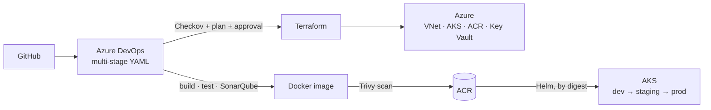

# Azure DevSecOps CI/CD Platform

An enterprise-grade Azure DevOps CI/CD platform featuring reusable YAML
pipelines, Infrastructure as Code, automated security scanning, container
image validation, quality gates, and automated deployments to AKS.
Demonstrates modern DevSecOps practices from code commit to production.

## What this demonstrates

- **Multi-stage YAML pipelines** — PR validation, infrastructure, and
  application pipelines built from reusable, parameterized templates.
- **Security shifted left** — Gitleaks (secrets), SonarQube (SAST + quality
  gate), Checkov (IaC), and Trivy (filesystem + container image) run before
  anything is published or deployed, with pinned scanner versions and
  justified-only suppressions.
- **Infrastructure as Code** — Terraform modules for VNet, AKS, ACR,
  Key Vault, and workload identity, promoted through validate → plan →
  manual approval → apply per environment.
- **Zero stored credentials** — workload identity federation (OIDC)
  everywhere; no service principal secrets, no ACR admin user, secrets served
  from Key Vault–linked variable groups.
- **Immutable promotion** — one scanned image digest travels dev → staging →
  prod behind environment approval gates, with smoke tests and automated
  Helm rollback.

## Architecture

See [docs/architecture.md](docs/architecture.md) for the full picture,
diagrams, and design invariants.



## Repository structure

```
├── app/                    # Sample workload: orders-api (Python) + unit tests + Dockerfile
├── charts/orders-api/      # Helm chart, values per environment
├── terraform/
│   ├── modules/            # network, aks, acr, keyvault, identity
│   └── environments/       # dev / staging / prod tfvars + backend configs
├── pipelines/
│   ├── pr-validation-pipeline.yml
│   ├── infrastructure-pipeline.yml
│   ├── application-pipeline.yml
│   └── templates/          # reusable steps/jobs: security, build, terraform, deploy
└── docs/                   # architecture, strategies, pipeline design, runbooks
```

## Documentation

| Document | Contents |
|---|---|
| [Architecture](docs/architecture.md) | Components, identity flow, design invariants |
| [Branching strategy](docs/branching-strategy.md) | Trunk-based flow, branch protection, PR rules |
| [Environment strategy](docs/environment-strategy.md) | dev/staging/prod matrix, ADO Environments, isolation |
| [Release strategy](docs/release-strategy.md) | Versioning, promotion, rollback layers |
| Pipeline design | *(phase 7)* stage-by-stage design of the three pipelines |
| Variable groups | *(phase 7)* full variable inventory, Key Vault linkage |
| Rollback runbook | *(phase 7)* operational rollback procedures |
| [Roadmap](ROADMAP.md) | *(phase 7)* post-v1 improvements |

## Status

Built incrementally, one reviewed phase per branch — see the
[branching strategy](docs/branching-strategy.md) this repo itself follows.

| Phase | Scope | Status |
|---|---|---|
| 1 | Foundation: structure, strategies, architecture | ✅ |
| 2 | Terraform modules + environments | ⏳ |
| 3 | orders-api application + tests + Dockerfile | ⏳ |
| 4 | Helm chart | ⏳ |
| 5 | Reusable pipeline templates | ⏳ |
| 6 | PR / infrastructure / application pipelines | ⏳ |
| 7 | Full documentation + roadmap | ⏳ |
