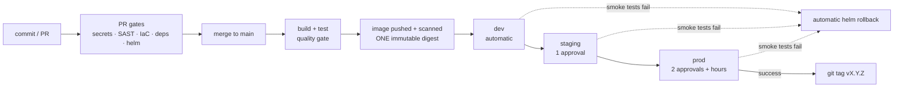

# Azure DevSecOps CI/CD Platform

An enterprise-grade Azure DevOps CI/CD platform featuring reusable YAML
pipelines, Infrastructure as Code, automated security scanning, container
image validation, quality gates, and automated deployments to AKS.
Demonstrates modern DevSecOps practices from code commit to production.

**Stack:** Azure DevOps · Terraform · Docker · AKS · ACR · Azure Key Vault ·
Helm · SonarQube · Checkov · Trivy · Gitleaks · GitHub

## The delivery path



Five properties the design guarantees, not just encourages:

1. **Nothing unscanned reaches `main`** — branch protection requires the PR
   pipeline: Gitleaks (full history), SonarQube quality gate, Checkov, Trivy,
   helm lint against every environment's values.
2. **The digest scanned is the digest deployed** — captured at push, carried
   through stages, pinned in Helm, preserved across per-env registries by
   `az acr import`. Tags are for humans.
3. **Zero stored credentials** — workload identity federation (OIDC) for
   every Azure touchpoint; no service principal secrets, no ACR admin user,
   AKS local accounts disabled, secrets served from Key Vault–linked
   variable groups.
4. **Approvers see exactly what runs** — Terraform apply consumes the
   reviewed plan artifact; deploy approvals are audited ADO Environment
   checks, never YAML conditions.
5. **Every deploy can undo itself** — `helm --atomic`, in-cluster smoke tests
   that assert the deployed revision, and an on-failure rollback job.

## Repository structure

```
├── app/                        # orders-api (FastAPI) · 13 unit tests, 100% cov · hardened Dockerfile
├── charts/orders-api/          # Helm chart: digest-pinned image, PSS-restricted, per-env values
├── terraform/
│   ├── modules/                # network · aks · acr · keyvault · identity
│   └── environments/           # dev / staging / prod tfvars + isolated state configs
├── pipelines/
│   ├── pr-validation-pipeline.yml
│   ├── infrastructure-pipeline.yml
│   ├── application-pipeline.yml
│   └── templates/              # reusable: security/ build/ terraform/ deploy/
├── docs/                       # design docs + runbooks (below)
├── .checkov.yaml  .gitleaks.toml  .trivyignore   # justified-only suppressions
└── ROADMAP.md
```

## Documentation

| Document | Contents |
|---|---|
| [Architecture](docs/architecture.md) | Components, trust boundaries, identity flow, design invariants |
| [Pipeline design](docs/pipeline-design.md) | Stage-by-stage design of all three pipelines, with diagrams |
| [Branching strategy](docs/branching-strategy.md) | Trunk-based flow, branch protection, why not GitFlow |
| [Environment strategy](docs/environment-strategy.md) | dev/staging/prod matrix, ADO Environments + checks, isolation rules |
| [Release strategy](docs/release-strategy.md) | Versioning, digest promotion, three rollback layers |
| [Security controls](docs/security-controls.md) | Control matrix: 10 gates, what blocks, suppression policy |
| [Variable groups](docs/variable-groups.md) | Full variable inventory, Key Vault linkage, cross-env RBAC |
| [Setup guide](docs/setup-guide.md) | Bootstrap state, wire ADO connections/environments/groups |
| [Rollback runbook](docs/runbooks/rollback.md) | Operational rollback, layer by layer |
| [Roadmap](ROADMAP.md) | DAST, SBOM/signing, preview envs, progressive delivery, DORA |

## Local verification

No pipeline required to check the code:

```bash
# Terraform
terraform -chdir=terraform fmt -check -recursive
terraform -chdir=terraform init -backend=false && terraform -chdir=terraform validate

# Application (Python 3.9+)
cd app && pip install -r requirements-dev.txt && pytest   # coverage gate: 90%

# Helm (if installed)
helm lint charts/orders-api --values charts/orders-api/values-prod.yaml --strict
```

## Build history

Built incrementally, one reviewed phase per `feature/*` branch — the repo
practices the trunk-based workflow it documents.

| Phase | Scope |
|---|---|
| 1 | Foundation: structure, strategies, architecture |
| 2 | Terraform modules + environments |
| 3 | orders-api application + tests + Dockerfile |
| 4 | Helm chart |
| 5 | Reusable pipeline templates + scanner configs |
| 6 | PR / infrastructure / application pipelines |
| 7 | Full documentation + roadmap |
