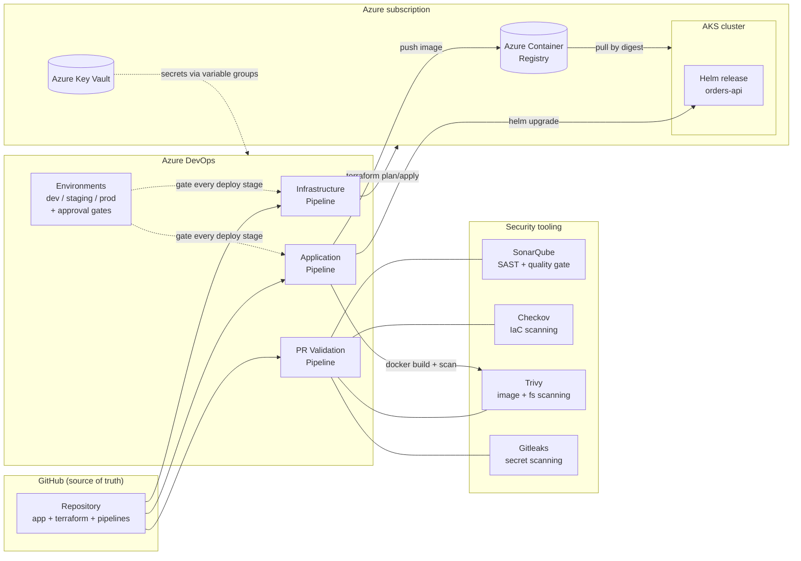
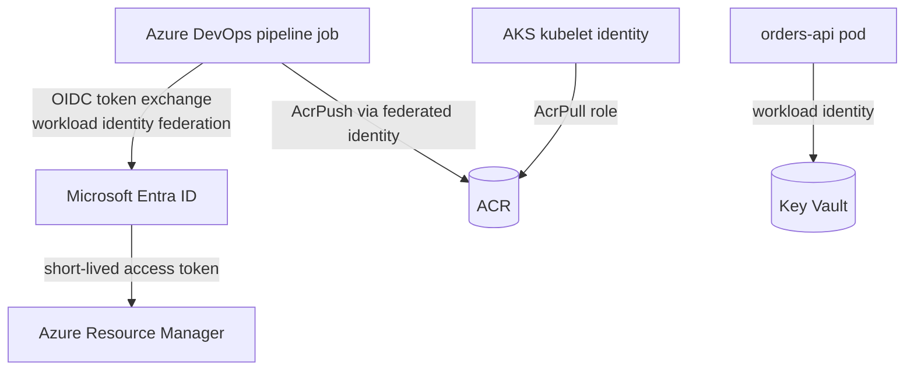

# Platform Architecture

This document describes the target architecture of the DevSecOps CI/CD platform:
the Azure infrastructure it provisions, the delivery toolchain that operates on it,
and the trust boundaries between them.

## High-level overview

## Components

### Source control — GitHub

GitHub hosts a single repository containing application code, Terraform,
Helm chart, and pipeline definitions. Azure DevOps consumes it through a
service connection; pipelines are defined as YAML in-repo so every change
to the delivery process is itself code-reviewed.

### Orchestration — Azure DevOps

Three pipelines with distinct responsibilities (see
[pipeline-design.md](pipeline-design.md)):

| Pipeline | Trigger | Purpose |
|---|---|---|
| PR validation | Pull request | Fast feedback: lint, unit tests, SAST, IaC scan, secret scan. Never deploys. |
| Infrastructure | Push to `main` (paths: `terraform/**`) | validate → plan → **manual approval** → apply, per environment |
| Application | Push to `main` (paths: `app/**`, `charts/**`) | build → test → scan → push to ACR → Helm deploy dev → staging → prod with gates |

Deployment approvals live on **Azure DevOps Environment resources**, never in
YAML — so changing an approval policy is an audited portal operation, not a
code change an author could slip past review.

### Security tooling

Every gate runs in the pipeline, before anything is published or deployed:

- **Gitleaks** — secret scanning over the full git history on PRs.
- **SonarQube** — SAST and code-quality gate on the application code.
- **Checkov** — policy-as-code scanning of Terraform before plan.
- **Trivy** — filesystem scan on PRs; image scan after every Docker build,
  blocking on HIGH/CRITICAL before the image can reach ACR.

### Runtime — Azure

Terraform provisions, per environment:

- **VNet + subnets + NSGs** (`modules/network`) — private networking for the cluster.
- **AKS** (`modules/aks`) — managed Kubernetes, workload identity enabled,
  Azure CNI, API server authorized ranges.
- **ACR** (`modules/acr`) — Premium registry; AKS pulls via managed identity
  (`AcrPull`), no admin credentials.
- **Key Vault** (`modules/keyvault`) — RBAC-mode vault backing the Azure DevOps
  variable groups; pipelines and workloads read secrets at runtime, nothing is
  stored in the repo or pipeline definitions.
- **Identity** (`modules/identity`) — user-assigned managed identities and OIDC
  federated credentials for pipeline → Azure auth (zero stored service
  principal secrets).

## Trust boundaries and identity flow

Design invariants (deliberate, documented so they survive refactors):

1. **Zero stored credentials.** All pipeline → Azure auth uses workload
   identity federation (OIDC). No service principal secrets, no PATs in
   variable groups, no ACR admin user.
2. **Images are referenced by digest** from scan to deploy — the digest Trivy
   scanned is the digest Helm deploys; tags are for humans only.
3. **Approvals are environment resources**, configured in the Azure DevOps
   portal with audit history — never `condition:` expressions in YAML.
4. **Scanner versions are pinned** as template parameters so runs are
   reproducible and upgrades are explicit diffs.
5. **Suppressions require written justification** — `.checkov.yaml`,
   `.gitleaks.toml`, and `.trivyignore` entries must carry a comment with
   owner and reason, enforced by review convention.

## Environment topology

Three long-lived environments, isolated at the resource-group level with
separate state files and separate variable groups. Sizing and guardrails
scale up toward prod (see [environment-strategy.md](environment-strategy.md)).

| | dev | staging | prod |
|---|---|---|---|
| Purpose | integration | pre-prod rehearsal | live |
| AKS nodes | 1 × B-series | 2 × D-series | 3 × D-series, zones |
| Deploy gate | automatic | approval | approval + business hours check |
| Terraform apply | approval | approval | approval (separate approvers) |
