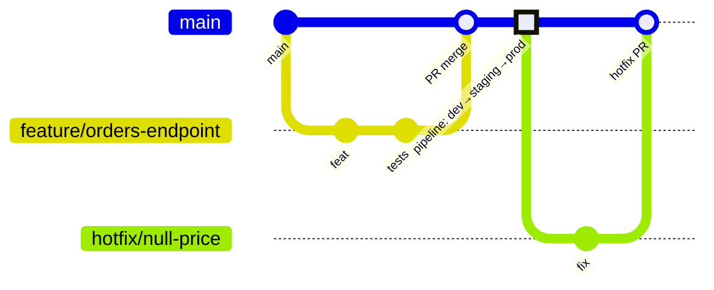

# Branching Strategy

The platform uses **trunk-based development with short-lived feature branches**.
This is the strategy that fits automated delivery: every merge to `main` is a
release candidate, and the pipeline — not a branch hierarchy — decides what is
safe to promote.

## Model

| Branch | Lifetime | Rules |
|---|---|---|
| `main` | permanent | Protected. PR-only, no direct pushes. Always deployable. |
| `feature/<slug>` | days | Branched from `main`, merged via PR, deleted after merge. |
| `hotfix/<slug>` | hours | Same flow as feature, expedited review; the pipeline is the same — hotfixes are not allowed to skip gates. |

There are **no** `develop`, `release/*`, or environment branches. Environments
are promotion stages inside one pipeline run, not branches — this removes an
entire class of drift ("staging branch differs from prod branch") and makes
`main`'s history the release history.

## Branch protection (`main`)

Enforced in GitHub settings:

- Require a pull request before merging (1 approval minimum).
- Require status checks: the **PR validation pipeline** must pass
  (build, unit tests, SonarQube quality gate, Checkov, Trivy fs scan, Gitleaks).
- Require branches to be up to date before merging.
- Require linear history (squash or rebase merges only).
- No force pushes, no deletions, administrators included.

## Pull request flow

1. Branch from `main`: `feature/<short-description>`.
2. Commit using [Conventional Commits](https://www.conventionalcommits.org/)
   (`feat:`, `fix:`, `docs:`, `ci:`, `refactor:`, `test:`, `chore:`) —
   the release notes are generated from these.
3. Open a PR. The PR validation pipeline runs automatically; a failed security
   gate is a blocking check, not a warning.
4. One approving review + green checks → squash-merge. The squash commit
   message follows Conventional Commits.
5. Merge to `main` triggers the infrastructure and/or application pipeline
   based on changed paths.

## Why not GitFlow?

GitFlow optimizes for scheduled, versioned releases with parallel maintenance
lines. This platform releases continuously: promotion is controlled by
pipeline gates and environment approvals, so extra long-lived branches would
only add merge overhead and drift risk. The decision is intentional and should
be revisited only if the delivery model changes (e.g. boxed on-prem releases).
