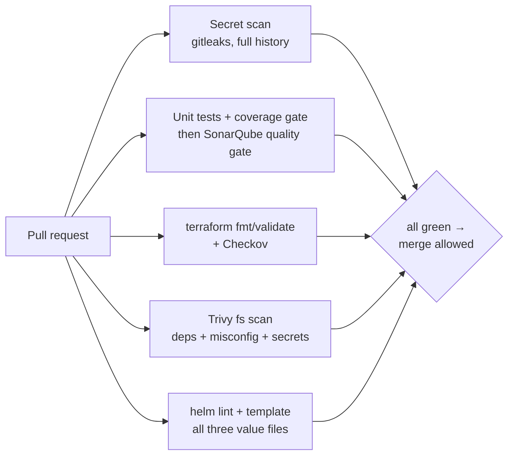
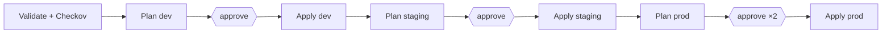
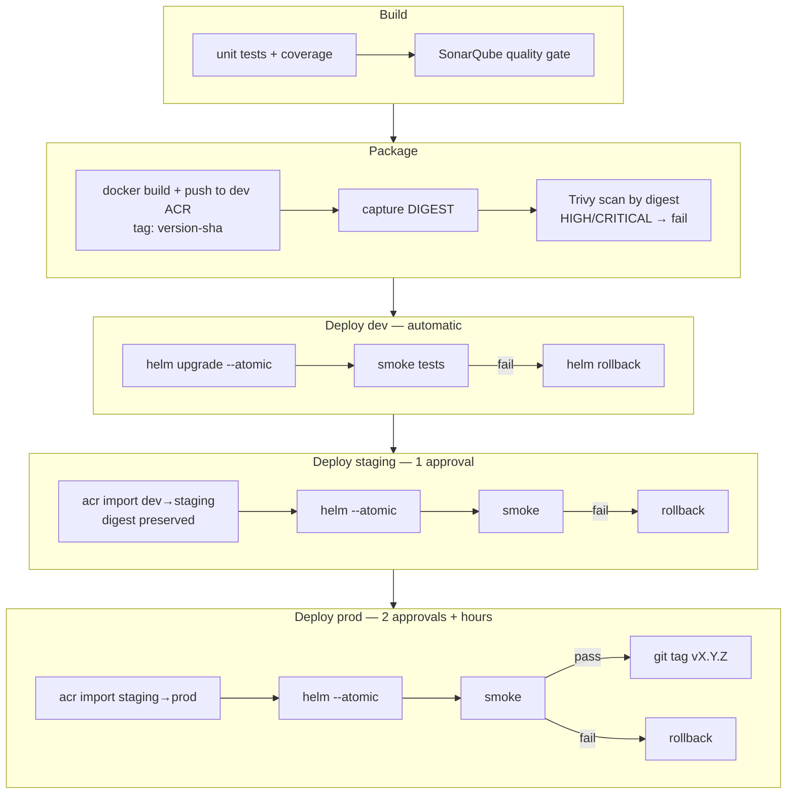

# Pipeline Design

Three pipelines, one responsibility each, all composed from the reusable
templates in `pipelines/templates/`. Scanner and tool versions are pinned as
template parameters; upgrading a scanner is a reviewable one-line diff.

## 1. PR validation (`pr-validation-pipeline.yml`)

Runs on every pull request to `main`; branch protection requires it. All jobs
run in parallel — total wall time is the slowest gate, not the sum.

Design choices:

- **Never deploys, never touches Azure** — terraform validation is
  backend-free, so a malicious PR cannot exfiltrate credentials it never has.
- **Full-history secret scan** (`fetchDepth: 0`) — a secret added and removed
  three commits ago is still leaked.
- **Helm charts are templated against all environments**, catching
  values-file drift before merge, not at prod deploy time.

## 2. Infrastructure pipeline (`infrastructure-pipeline.yml`)

Triggers on `main` pushes touching `terraform/**` (and its own definition).

Design choices:

- **The plan artifact is the contract.** Plan publishes a binary `.tfplan`
  plus its human-readable rendering; Apply downloads and applies exactly that
  file. Approvers never approve "whatever apply computes later".
- **Approvals are ADO Environment checks** on `devsecops-<env>`, not YAML —
  see [environment-strategy.md](environment-strategy.md).
- **No-change plans skip Apply** (via `-detailed-exitcode`) so approvers are
  only interrupted by real changes, and the skip does not break the
  dev → staging → prod chain (`not(or(failed(), canceled()))` on each Plan).
- **State is selected per environment** with `-backend-config`; the same root
  module serves all three environments.

## 3. Application pipeline (`application-pipeline.yml`)

Triggers on `main` pushes touching `app/**` or `charts/**`.

Design choices:

- **One digest end to end.** The digest captured at push is exported as a job
  output, read by every deploy stage via `stageDependencies`, and pinned in
  the Helm release (`image.digest` beats `image.tag` in the chart). `az acr
  import` copies the manifest unchanged between per-environment registries,
  so the digest Trivy scanned is byte-identical to what prod runs.
- **The image scan is a stage every deploy depends on.** A vulnerable image
  may exist in the dev registry, but no path to a cluster exists around the
  scan.
- **Smoke tests close the loop**: they assert health, a real endpoint
  round-trip, and that `/version` reports the exact commit this run built —
  catching "green deploy of the wrong artifact" failures.
- **Rollback is a job, not a hope**: on any deploy/smoke failure, a dedicated
  `condition: failed()` job runs `helm rollback --wait` and verifies rollout
  status. `--atomic` already covers rollouts that never became healthy.

## Cross-cutting conventions

| Convention | Where enforced |
|---|---|
| Scanner versions pinned | template parameters (`gitleaksVersion`, `trivyVersion`, `checkovVersion`, `terraformVersion`, `helmVersion`) |
| Suppressions need written justification | `.checkov.yaml`, `.gitleaks.toml`, `.trivyignore` header conventions |
| Approvals never in YAML | ADO Environment checks |
| No stored credentials | every Azure step is `AzureCLI@2` against an OIDC-federated service connection |
| Paths-filtered triggers | app and infra pipelines ignore each other's files; docs changes trigger nothing |
