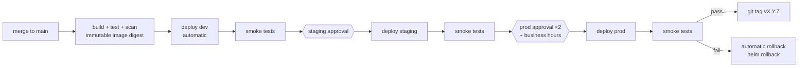

# Release Strategy

Releases are **continuous, artifact-driven promotions**: every merge to `main`
produces one immutable, scanned container image that is promoted unchanged
through dev → staging → prod. There is no "release build" separate from the CI
build — the artifact that passed the gates is the artifact that ships.

## Versioning

- **Image tags**: `<semver>-<shortsha>` (e.g. `1.4.2-a1b2c3d`), derived from
  the app's `VERSION` file plus the commit. Tags are informational only.
- **Deploys reference the image digest** (`sha256:…`) captured at build time
  and passed between stages as a pipeline artifact — the digest Trivy scanned
  is provably the digest Helm deploys.
- **Helm chart version** tracks the app version; the release name is stable
  (`orders-api`) so history is a single lineage per environment.
- **Git tags**: prod deploy stage pushes an annotated tag `v<semver>` on
  success, making "what is in prod" answerable from git alone.

## Promotion flow

Rules:

- A stage only runs if every previous stage succeeded — no cherry-picking
  stages, no "deploy to prod only" runs.
- Skipping staging is impossible by construction; expedited hotfixes go
  through the same stages with expedited *approvals*, not fewer gates.
- Multiple merges queue: the environment exclusive-lock check serializes
  deploys, and a newer run supersedes an older one waiting for approval.

## Deployment technique

Helm-managed rolling updates on AKS:

- `helm upgrade --install --atomic --timeout 5m` — if the rollout does not
  become healthy in time, Helm reverts the release automatically.
- Deployment uses `maxUnavailable: 0, maxSurge: 1` with readiness probes, so
  capacity never drops during rollout.
- Post-deploy **smoke tests** hit `/healthz` and one real endpoint through the
  service; failure triggers the rollback job (see below).

## Rollback strategy

Three layers, fastest first:

1. **Automatic, in-run** — `--atomic` reverts a rollout that never became
   healthy; smoke-test failure triggers the pipeline's rollback job, which
   runs `helm rollback <release> 0 --wait` (previous revision) and re-runs
   smoke tests to confirm recovery.
2. **Manual, one command** — the standalone rollback stage of the application
   pipeline can be run against any environment to roll back to the previous
   (or a named) Helm revision. Documented in
   [runbooks/rollback.md](runbooks/rollback.md).
3. **Roll forward** — for defects that survive a rollback (data/schema
   issues), fix on a `hotfix/*` branch through the normal PR + pipeline flow.

Infrastructure rollback is **git-driven**: revert the Terraform commit and let
the infrastructure pipeline plan/approve/apply the revert. Manual portal
changes to recover an incident must be back-ported to Terraform the same day
(drift is detected by the scheduled plan run).

## Release notes and audit trail

- Squash-merged Conventional Commits make `git log --oneline` between two
  prod tags a readable changelog.
- Azure DevOps environment history records who approved and deployed what,
  when, with the run linking back to the exact commit and image digest.
